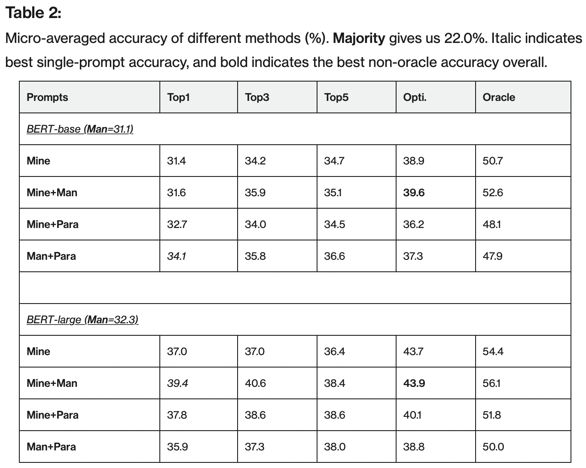
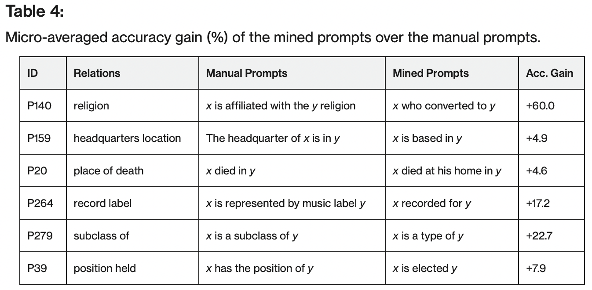
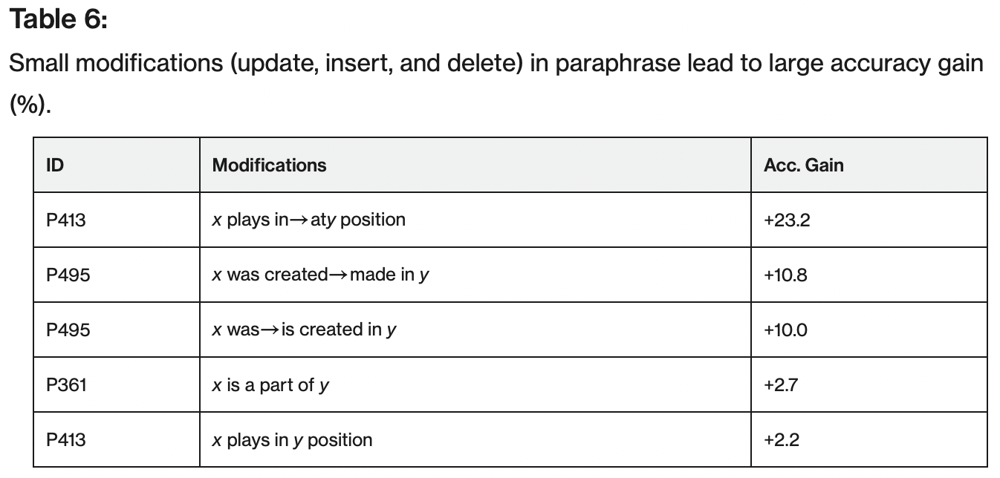
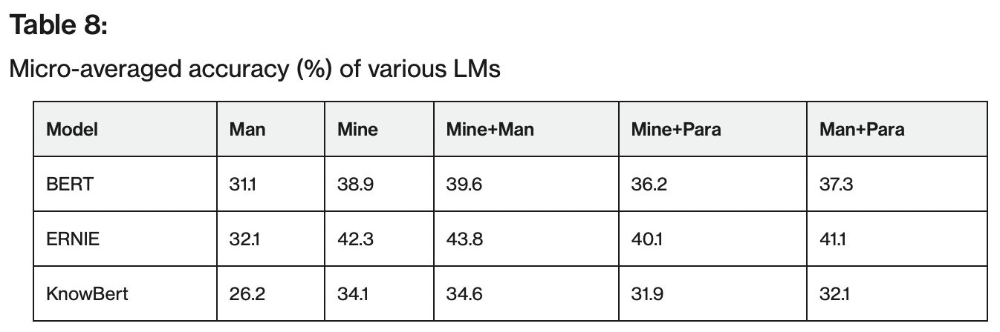

## How Can We Know What Language Models Know? 

Zhengbao Jiang, Frank F. Xu, Jun Araki, Graham Neubig - TACL 2020

Presented by Aarohi Srivastava on July 28, 2023

## Introduction
Main Idea: We know prompting can be a brittle method. But many people use prompting as a way of extracting knowledge from an LM and evaluating what the LM knows.

This paper: How can we discover/mine/generate prompts in the most appropriate form for the LM.

Achievement: Using their method, BERT's performance on the LAMA (LAnguage Model Analysis) benchmark for knowledge extraction (with reformulated prompts) increases, indicating:
1. Their method helps formulate a prompt in such a way that it will actually work on BERT.
2. BERT knows more than you may have thought.
3. These results may extend to other LMs (including GPT family).

You may be wondering how you can give a prompt to BERT (rather than GPT) -- I think they mean test BERT with the fill-mask objective.

## Task/Data
T-REx subset of the LAMA benchmark that consists of 41 Wikidata relations and at most 1000 facts per relation. They are expressed as knowledge triples (entity 1, entity 2, relationship between them: 41 options). An example of a relation is *capital-of*.

## Prompt Generation

### Mining-based Generation
* Middle-word prompts: Barack Obama was born in Hawaii --> x was-born-in y (just assume the middle is the relation).
* Dependency-based prompts: use the dependency parse to figure out the elements of the knowledge triple:
  * The capital of France is Paris --> capital-of x is y
  * Dependency parse tells us that France is the object of the prepositional phrase and Paris is the subject of the sentence.
* Once you know the x, the y, and the relation, you can reorder the sentence in the most desirable way - see Prompt Selection section. *y* will be the answer we want to elicit.

### Paraphrasing-based Generation
* Once you have the elements of the knowledge triple, the other issue that remains is that the words pertaining to the relation might not be the most appropriate.
* To paraphrase/reword the relation phrase, they translate the prompt into another language (take top B candidates), and back-translate each of these into the original language (probably English) keeping the top B.  The resultant B^2 candidates are ranked by probability, and the top T are kept:
  * P_forward(t'|t^) * P_backward(t|t') where:
    * t^: initial prompt
    * t': translated prompt
    * t: final (back-translated) prompt
* They use B=7, T=40, source language English, target language German.

## Prompt Selection and Ensembling
* Top-1 prompt selection: for each relation, measure the LM's accuracy on the training data (using x and r to formulate the prompt, and it must predict y). At test time, when encountering this relation, use the prompt that gave the highest accuracy on the training data.
* Rank-based ensemble: treating the top K prompts equally, average the log probabilities  (i.e., which come from the LM) from the top K prompts.
* Optimized ensemble: same as above but optimize the weights of the top-K prompts rather than treating them equally.

## Experiments
* Models: BERT-base, BERT-large, ERNIE, KnowBert
  * ERNIE and KnowBert are enhanced with external entity representations.
* Metrics: accuracy, macro-averaged accuracy (each unique *y* weighted equally)
* Scores to compare:
  * Man: the original prompts used in the original LAMA paper
  * Mine: mining-based generation (middle word and dependency-based)
  * Mine+Man: include both when doing prompt selection
  * Mine+Para: apply paraphrasing-based method to the mining generated prompts
  * Man+Para: apply paraphrasing-based method to the original prompts
  * Oracle: when *any* of the top 40 generated prompts give the correct answer

## Results

* "It can be seen that the largest gains from using mined prompts seem to occur in cases where the manually defined prompt is more complicated syntactically, or when it uses less common wording than the mined prompt."

* Interesting: average edit distance is 3.27 for mined vs. original, and 2.73 for paraphrased vs. original.

* Benefits of the method are maximized when using ERNIE instead of BERT.

## Our Discussion
* Does it count as "knowing" if you have to ask the question in a very specific way?
* Information retrieval is often done using a database with a schema, where you can use SQL queries to access information (pipeline often goes text2sql, then execute query on schema). Now we are talking about information retrieval from an LM using natural language prompts. What do you think about these two paradigms?
  * Which do you want to learn about more?
  * Which do you think will become prevalent in industry?
  * Which do you think will garner more interest in academia?
* What do you think about LMs being used as a knowledge source?
