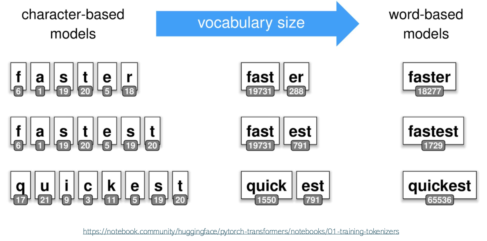
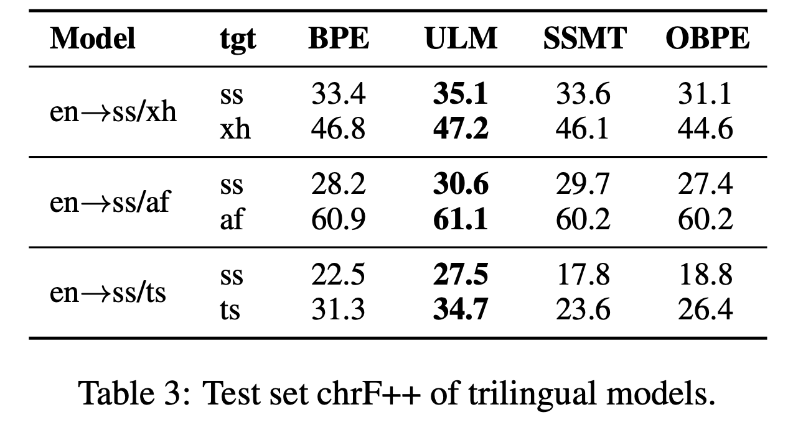
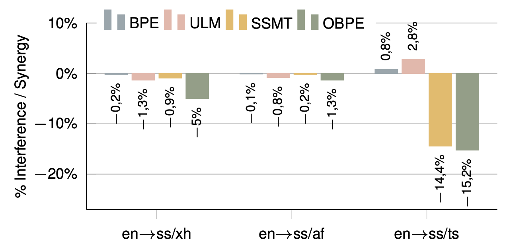
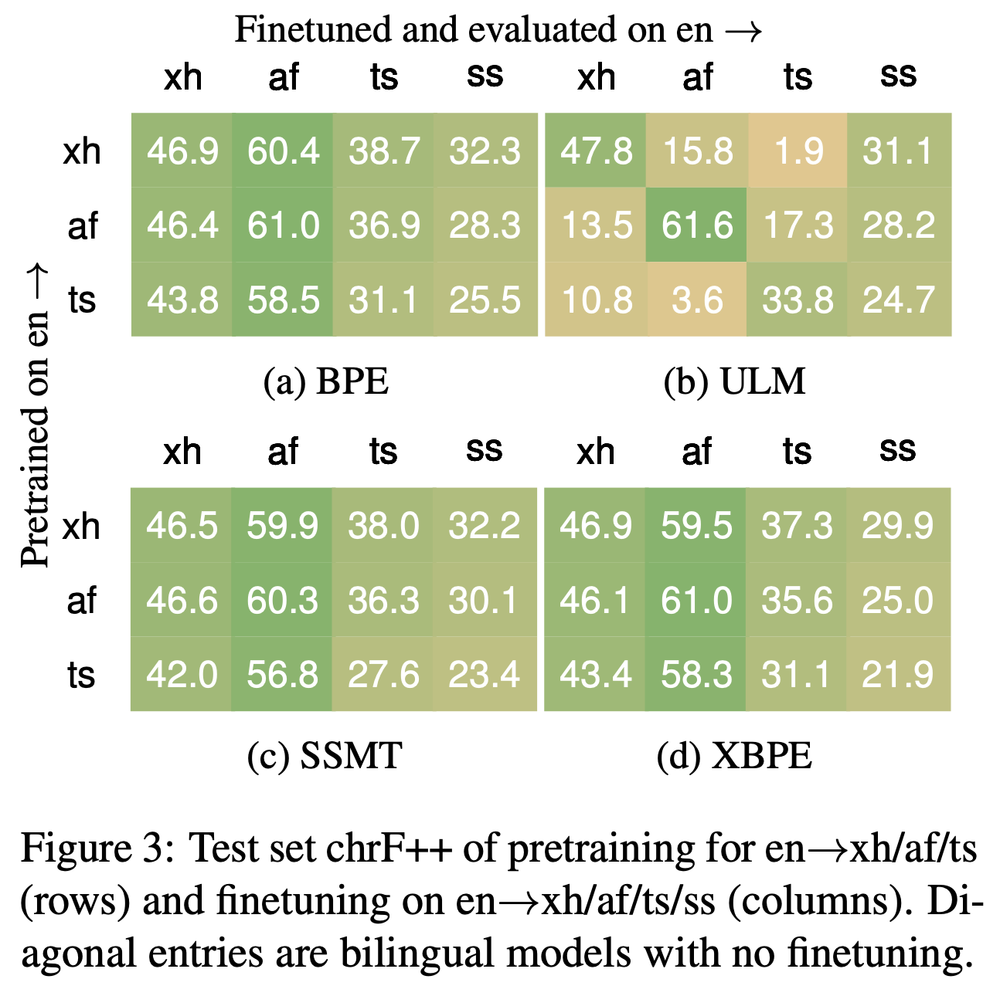

### A Systematic Analysis of Subwords and Cross-Lingual Transfer in Multilingual Translation

By Francois Meyer and Jan Buys in NAACL 2024 Findings

Presented by Aarohi Srivastava on August 23, 2024

#### Subword tokenization

#### Introduction

Premise: Tradeoff between *synergy* and *interference*.
* Synergy - shared parameter space and subword vocabulary can facilitate positive transfer from high to low resource languages.
* Interference - there can also be negative cross-lingual interactions which can result in sub-optimal performance for the high-resource languages.

Goal: To analyze the role of subword segmentation in MT with respect to:  
* type of subword tokenization used
* linguistic features of languages (morphology and orthography)
* scenario (multilingual MT vs. cross-lingual fine-tuning)
* synergy, interference, and knowledge transfer

#### Languages

| Language | Family | Morphology | Orthography |
| -------- | ------ | ---------- | ----------- |
| Siswati (ss) | Bantu/Nguni | agglutinative | conjunctive |
| isiXhosa (xh) | Bantu/Nguni | agglutinative | conjunctive |
| Setswana (ts) | Bantu/Sotho-Tswana | agglutinative | disjunctive |
| Afrikaans (af) | Germanic | analytic | disjunctive |

* Agglutinative (vs. analytic) morphology - morphemes serve clearer, smaller roles on their own and join together, leading to a higher number of morphemes per word (longer words).
* Conjunctive vs. disjunctive orthography - the various elements of a word (such as a verb and its person) are written as separate words in disjunctive orthography, but as together in one word in conjunctive orthography.
  *  In particular, even if languages are less closely related, if they are both disjunctive, it might make MT easier as there is stronger one-to-one alignment (see Setswana and Afrikaans).

#### Subword tokenization methods
* BPE - deterministic
* Unigram (ULM) w/ subword regularization - non-deterministic, model can see different tokenizations of the same sequence
* Subword segmental MT (SSMT) - segmentation learned jointly with MT training (optimized to MT performance)
* Overlap BPE (OBPE) - boost subword overlap across languages
* Extended BPE (XBPE) - new subwords (pertaining to the target language) are added to the vocabulary

#### Models trained
* Low-resource: English --> Siswati
* Higher resource: English --> isiXhosa / Setswana / Afrikaans
* Trilingual: English --> Siswati and isiXhosa/Setswana/Afrikaans
* Cross-lingual fine-tuning - fine-tune these on English to one of the unseen target languages (e.g., FT en-->xh on en-->ts)

Metric:
* ChrF++ is an MT metric that takes into account character n-gram matches (like ChrF) and also word n-gram matches. 
* If ChrF++ of the trilingual model is higher than that of the bilingual model, there is synergy. If it is lower, there is interference.

#### Which tokenization method promotes synergy and minimizes interference? ULM.

ULM (with subword regularization) comes out on top! The paper attributes this success to the robustness gained by seeing different tokenizations of the same sequences.

* Nothing is particularly strong at promoting synergy.
* SSMT and OBPE lead to much more interference, likely because they are specially tuned to the training setting/language pair.

#### Which tokenization method is best for cross-lingual transfer? BPE.
* BPE is best overall. SSMT and XBPE are close in performance, and for a few instances are even better (e.g., SSMT for Afrikaans to Siswati transfer).
* While ULM has the best performance on the diagonals (same language), it is not good for transfering to isiXhosa, Afrikaans, or Setswana. It is still good for transfer to Siswati (the low resource setting).

#### "What is the role of linguistic typology?"
* IsiXhosa has the strongest synergy with Siswati (closest language pair), while Setswana is the weakest (even though Setswana is closer to Siswati than Afrikaans).

#### Big Findings
* Subword regularization is beneficial in multilingual MT settings, but can be detrimental in cross-lingual transfer (FT on a third language).
* "Diverging word boundary conventions can impede cross-lingual transfer more than linguistic unrelatedness."

#### Discussion
* Did any result surprise you?
* Do you think the same results could extend to language modeling?
  * Should subword regularization be used for multilngual language modeling?
* How come ULM performance does not drop for the transfer to Siswati, but it does (drastically!) for the other transfer targets?
* Does the high interference for SSMT and OBPE make you think of anything?
