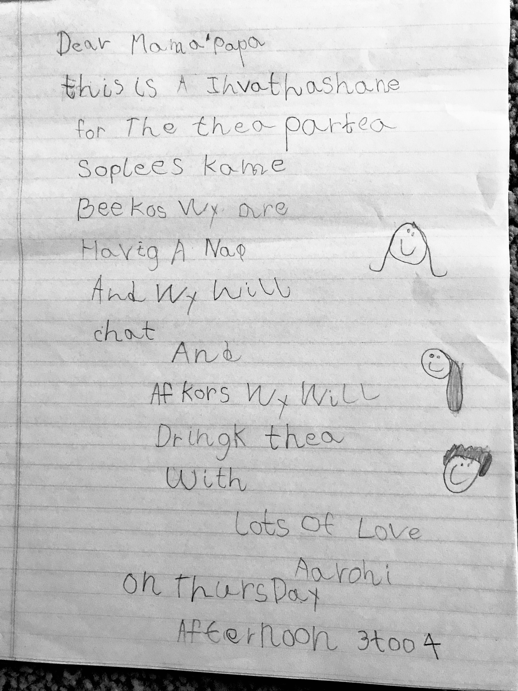

# On the Use/Misuse of the Term 'Phoneme'
_Roger K. Moore, Lucy Skidmore at Interspeech 2019_

_Presented by Aarohi Srivastava on 2/13/26_

## Background

NLP research is grounded in ideas from other disciplines, particularly linguistics. But not everyone working in NLP maintains a tight interface with linguistic theory, and as a result, technical linguistic terms sometimes get borrowed and used loosely. Today's paper looks at a specific instance of this, the use/misuse of the term "phoneme," particularly in speech conference papers.

Phoneme: "the smallest unit of speech that distinguishes one word from another _in a particular language_."

## Phonetic vs. Phonemic

The distinction between phonetic and phonemic levels of representation are probably the root of most misuse or misunderstanding. 
* Phonetic: language-independent fine-grained acoustic/articulatory realization, denoted between square brackets ([]).
* Phonemic: language-specific contrastive category, denoted between slashes (//).

I would go so far as to say a phone is a thing while a phoneme is a concept.

### Developmental Intuition

Babies start out as universal listeners of language. They are sensitive to phonetic distinctions across languages and are primed to natively acquire any language. You could imagine that early on, they operate at something like a phonetic level, tracking fine-grained acoustic distinctions without yet grouping them into language-specific categories. As they acquire a particular language (or multiple languages), they reorganize perception into phonemic categories. **They stop distinguishing certain differences because those differences are not contrastive in their language.**

### Understanding the distinction by comparing English and Hindi t

A while back, my mom had found a tea party invitation I wrote when I was 3. For context, I was bilingual in English and Hindi (but speaking and hearing 75% Hindi) and had learned the English alphabet but very little about spelling. I wrote:

This is a **invathashane** for the **thea** partea so plees kame.

What I see now (after Darcey pointed it out a while back) is that I maybe contrasted **aspirated** vs. unaspirated t in my writing. Though this is not a distinction we explicitly make in English, it is in Hindi (they are separate consonants). 

A few notes:
* Aspiration: burst of air that follows the release of a stop consonant.
* Voiced vs. voiceless consonant: Voiced consonants involve vibration of the vocal folds, while voiceless consonants do not. Consider [p] vs. [b] or [t] vs. [d].

Per English phonology, when a voiceless stop consonant is word-initial and/or at the onset of a stressed syllable (e.g., tea, pin, underpin), it is aspirated. Examples where it is not aspirated: stove, spy. (This is not a complete phonological analysis of aspiration in English.)
* Consider: tea → [tʰi]. If we replaced [tʰ] with [t] in tea, it might sound slightly accented, but it would still be perceived as *tea*.
* **[tʰ] and [t] are allophones of the same phoneme, /t/, in English.**
* This is not true in all languages.

An English phonemic transcription need not make this distinction (e.g., /ti/), while a phonetic transcription must. (It may still be noted in phonemic transcriptions because it is a more obvious feature, but it does not need to be there.)

This brings us to another definition of phoneme provided in the paper: "a family of uttered sounds (segmental elements of speech) in a particular language which count for practical purposes as if they were one and the same."
  
In Hindi, stop aspiration is a **contrastive feature** that can change the meaning of a word. So is the place of articulation for t!
* ताल - /t̪aːli/ - to clap
* थाल - /t̪ʰaːli/ - plate
* टोक - /ʈoːk/ - to pester/interrupt/object
* ठोक - /ʈʰoːk/ - to hammer (hit a nail)

Dental, alveolar and retroflex refer to the **place of articulation**, or where the tip of the tounge is when producing the sound. Alveolar is towards the front of the roof of the mouth while retroflex is further back. Dental would be directly behind/on the front teeth.
* alveolar: [t]
* dental: [t̪]
* retroflex: [ʈ]

In Hindi, a phonemic transcription must distinguish /t̪/, /t̪ʰ/, /ʈ/, and /ʈʰ/, because both place (dental vs retroflex) and aspiration are contrastive. In English, by contrast, these distinctions are not phonemic. **Even if a Hindi-accented speaker realized “tea” as [ti], [t̪i], or [ʈi], all of these would be mapped onto the same English phoneme /t/**, since none of these differences signal a change in lexical meaning in English.

**Takeaway**: 

I hope these examples clarify the distinction between phonetic and phonemic levels of representation, and when to use square brackets [] versus slashes // (which I have tried to do consistently). 
* **Phonemic transcriptions** (//) represent contrastive categories within a particular language. It abstracts away from predictable variation and encodes only those distinctions that differentiate words in that language. Because phonemes are language-specific, a phonemic transcription must always be interpreted relative to a particular language. There is no such thing as a language-independent phonemic representation.
* **Phonetic transcriptions** ([]) represent precise articulatory or acoustic realization, independent of whether they are contrastive in any given language. When discussing sounds across languages, square brackets are appropriate.
* Importantly, when using phonetic notation, we should be as precise as necessary. We cannot collapse distinctions simply because they are not contrastive in English. For example, [t], [t̪], and [ʈ] are articulatorily distinct sounds, even if English speakers map them all to /t/. Using [t] to represent all of them would impose an English phonological interpretation onto what is meant to be a language-neutral phonetic description. I suspect that is a key issue if non-linguists try to write a phonetic transcription.

*A phoneme is defined by the contrastive structure of a particular language, not by universal acoustic substance. The brackets we choose signal which level of representation we are committing to.*

## Implications

The paper points out three implications of why this phonetic–phonemic distinction matters, and in particular why a phonemic representation is often valuable.

1. **Phoneme restoration effect**: if a short section of speech was cut out and replaced by another sound, a native or proficient listener would not detect anything was missing. This is a strong demonstration that we are not simply decoding acoustic input; we are mapping it onto phonemic expectations shaped by the structure of our language. A phonetic transcription, being language-independent, is not supposed to fill in those blanks.
    *  I think it is important to note that the paper implicitly assumes native or highly proficient listeners in most descriptions. Such effects depend on having a stable internalized phonemic system for a language. If someone is not yet fully locked into the phonology of a language, like an early L2 learner, a lot of this would not apply.
2. **Mapping expectations to phonemic realization**: When we expect to hear a particular sequence of sounds in a given linguistic context, we tend to perceive it as such, even if the acoustic signal is degraded. For example, if you yell across the house, “Johnny, did you feed your fish yet?”, you are realistically only expecting to hear something like “yes,” “no,” or “I don’t know.” What reaches your ears may just be muffled grunts, but you will often reconstruct the intended response anyway.
    *  Though this is mentioned as a distinct implication in the paper, I think it conveys the same point as #1.
3. **Coarticulation**: articulatory gestures overlap and unfold over time, so phonemic information is distributed across neighboring segments rather than packaged into clearly bounded acoustic units, challenging the idea that speech is composed of tidy, bead-like elements. 
    *  Why they mention this in the paper is unclear to me, but I think the point is that due to this reality, phonemes are inherently not acoustic units and should not be treated as such (while phones are).

## Results

1. Of the 265 accepted papers at INTERSPEECH 2018 that contained the term “phoneme,” only 6 offered a definition, and none of those were satisfactory according to the authors. Examples include:
   * “Speech signal consists of various basic speech sound units, which are called as phonemes.”
   * “...treat any sub-word acoustic unit as a phoneme.”
   * “In phonetics, it is believed that when one pronounces two neighbouring phonemes, there often exists joint frames that can be a very short pause belonging to neither phoneme...”
   * Equating phonemes with “sound symbols” or “sub words.”

   In the paper, the authors write that “what is perhaps most concerning is that 98% of the INTERSPEECH-2018 papers that used the term ‘phoneme’ did not provide any form of definition or explanation, presumably because the authors assumed that everyone knows what it means.” I personally do not find that concerning. If a term is used correctly and in context, it does not need to be redefined in every paper. If a paper is not centrally concerned with the phonetic vs. phonemic distinction, a formal definition may be unnecessary. On the other hand, if the term is being used incorrectly, attempting to define it would not fix the problem.

2. 40% of the 265 papers used the term “phoneme” in a way that could be construed as misuse by the authors. Examples include:
   * Papers that clearly conflate phonemic (/…/) and phonetic ([…]) notation.
   * References to “phonemic segmentation,” as if phonemes correspond to acoustically segmentable units.
   * Mentions of “phoneme durations,” implying that phonemes themselves have measurable temporal extent.
   * Phrases such as “phoneme chunks,” which treat phonemes as concrete sound blocks.

   The authors also list many specific phrases from INTERSPEECH papers that they consider misuse. I do not doubt that, in most of these cases, there is a flaw related to the phonemic/phonetic distinction. At the same time, I am not convinced that every cited example constitutes a serious conceptual error. A few such examples:
     * I think “If a phoneme lasts for more than 5 ms...” could more precisely be written as “if the acoustic realization of a phoneme lasts more than 5 ms,” but this feels somewhat pedantic. In NLP writing, shorthand often stands in for the intended level of abstraction.
     * “Treating filled pause as a special ‘phoneme’” seems to acknowledge its own looseness through the use of quotation marks, and may simply be a concise way of describing a modification to a model’s label space.
       
   That said, there are many clear cases of misuse that appear to misunderstand the language-specific and contrastive nature of phonemes, including:
     * “Universal phoneme mapping”
     * “We propose a language-independent phoneme segmentation method”
     * “We have 252 phonemes, of which there are 213 Mandarin and 39 English.”

3. The authors present additional empirical results comparing the use of "phoneme" in a few different conferences and in science vs. technology work. They find the distributions of usage are quite similar across these comparisons. Overall, they find that only about one-third of papers explicitly mention phonemes in the first place. It is worth reiterating that this paper is from 2019, so statistics may be different (and interesting to know) in more recent times.

## Implications to NLP/Speech Research
I think the paper is missing this section.

### Using phoneme to describe label space
Using “phoneme” to describe a model’s label space is not necessarily accurate. It is unclear whether a system is learning phonetic distinctions, phonemic abstractions, or some hybrid of the two (particularly when a system is trained to do orthographic transcription, which is neither of these). I think the three are often conflated in people's minds and are important to separate to have a solid understanding. Many modern models trained on orthographic targets (especially in alphabetic languages) may approximate phonemic categories, but they also encode phonetic detail in ways that are not strictly phonological. 

This raises a legitimate question: what is the appropriate term for such intermediate symbolic units? The terminology we choose implicitly commits us to a view of what the model is actually representing.

### Phonemic vs. phonetic modeling require different kinds of context
Context is always necessary in speech processing, but it is especially crucial for phonemic representation. Phonemic transcription abstracts away from predictable variation and encodes contrastive categories within a particular language. That means a model producing phonemic outputs must implicitly learn language-specific structure. Phonetic transcription, by contrast, aims to capture surface realizations and therefore depends more directly on fine-grained acoustic detail.

### Different tasks with different inductive biases
Phonetic and phonemic transcription are not just different output formats; they require different inductive biases. A model trained to produce phonemic labels may learn to ignore distinctions that are acoustically present but non-contrastive in the training language. Conversely, a model trained to capture detailed phonetic variation may not automatically learn which distinctions matter contrastively. These are fundamentally different learning problems.

Many ASR systems are trained to predict orthography, which in alphabetic languages can sometimes approximate a phonemic representation. As a result, models may implicitly learn to collapse phonetic variation into stable symbolic categories. This can make it harder to later recover fine-grained phonetic information (e.g., accent, dialect, aspiration) because the system has already been optimized to treat those differences as irrelevant noise.

If we casually use “phoneme” to describe any symbolic label space, we obscure what our models are actually representing. Are they learning contrastive, language-specific abstractions, or acoustic categories? The distinction matters for multilingual modeling, accent robustness, and transfer across languages.

### Other linguistics terms that are misused in NLP writing
The only one that came to mind is writing system vs. alphabet vs. script (which are all different things). I wonder if anyone can think of another collection of terms?

## The Invathashane

There were some words I clearly knew how to spell, but otherwise I was “sounding things out.” If we remove intentionally spelled words, what remains does not look like standard orthography, but it also is not purely phonetic. So what kind of transcription is this? I also apparently developed my own conventions: [i] represented as ea or ee, and [ə] written as something like a_e. These choices were not random; they reflect an emerging mapping between perceived sound categories and symbols.

To me, it looks like a phonemic transcription of my English idiolect at the time, shaped by bilingual acquisition. I seem to have marked distinctions (like aspiration with “h”) that English orthography does not encode, suggesting that those contrasts had not yet been fully collapsed in my internal system. It feels like a snapshot of a representation in transition, somewhere between phonetic detail and stabilized phonemic categories. I’m curious how others would analyze it.

## A Note About Speech LMs
Popular speech LMs (i.e., generative speech model but not purely text-to-speech):
* AudioLM (Google)
* SoundStorm (Google)
* Voicebox (Meta)
* SeamlessM4T (Meta)

VALL-E (Microsoft) is text-to-speech so it's also valid to look at but not quite the same category.

AudioLM is the oldest, but briefly looking at the papers SoundStorm or Voicebox may be more informative. SeamlessM4T is massively multilingual so it would bring on some new content regarding that.
