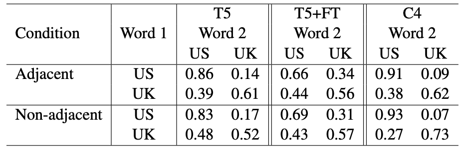
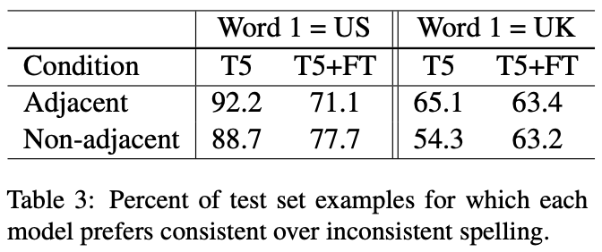
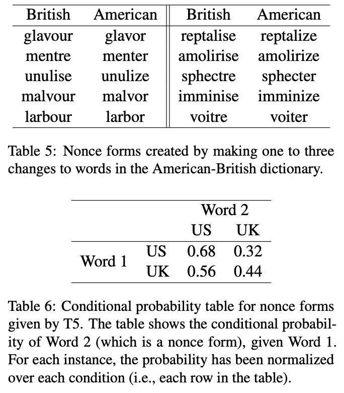
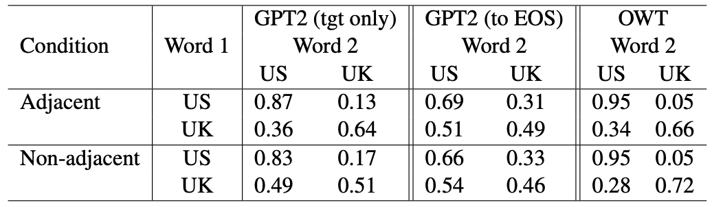
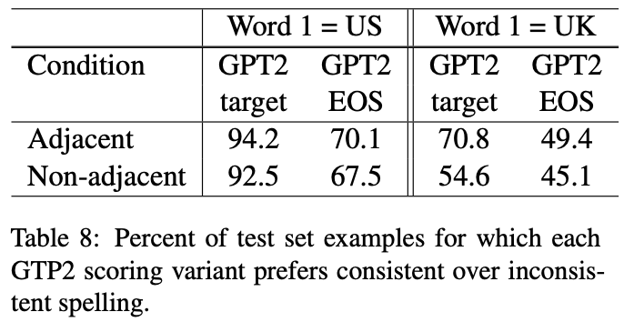

## Spelling Convention Sensitivity in Neural Networks

Elizabeth Nielsen, Christo Kirov, Brian Roark - EACL Findings 2023

Presented by Aarohi Srivastava on April 28, 2023

### Introduction
* Topic of interest: spelling convention consistency in language models (specifically decoding/generation).
* Approach: spelling convention consistency as a linguistic dependency.
* Past work on syntactic dependencies:
  * Probability of a grammatical sentence should be higher than an ungrammatical sentence.
  * Given a sentence where the main verb is a blank to fill, the model should prefer the verb that agrees in number to the subject (singular vs. plural).
  * Lots of evidence suggesting that Transformer-based LLMs are able to learn complex syntactic and semantic relationships.
* This work: The authors explore whether T5 and GPT-2 have a preference for maintaining consistency in spelling (American vs. British English) within a sentence when filling in blank spans (T5) or generating the next word (GPT-2).

### Data
* American British English Translator (ABET): list of American and British spelling variants.
  * vapor/vapour
  * realize/realise
  * liter/litre
  * aluminum/aluminium
* T5 is trained on Colossal Clean Crawled Corpus (C4), and GPT-2 is trained on WebText (OWT).
* Dataset analysis: For each sentence, extract all distinct pairs of words in the sentence such that both elements of the pair are words in ABET.  These pairs can fall into one of three classes:
  * US-matched - both are US variants
  * UK-matched - both are British variants
  * mismatched - one of each

### Experiments
* Create templates of the following form to minimize confounds and try to ensure syntactic and semantic acceptability. Templates include one work marked as US or UK, and include a blank span that the model should only fill with spellings belonging to the same variety.
* Two settings for placement of blank: adjacent or non-adjacent.
* Template: My preferred words are ..., ..., and tree.

#### T5
* prompt: 
  * Adjacent: My preferred words are **PRIME**, \<BLANK-SPAN-1\>, and tree.
  * Non-adjacent: My preferred words are **PRIME**, flower, interesting, jump, ponderous, sky, skipping, desk, small, ladder, lovely, \<BLANK-SPAN-1\>, and tree.
* test sentences:
  * My preferred words are realize, {center, centre}, and tree.
    * Probability of choosing *center* should be higher than *centre*.
  * My preferred words are realise, {center, centre}, and tree.
    * Probability of choosing *centre* should be higher than *center*.
* fine-tuning: 
  * They created a US version and a UK version of the British National Corpus (BNC), based on the spellings of words in ABET. They fine-tune T5 (with the pre-training objective) on this data (US + UK versions).
  * This provides a balanced dataset with guaranteed consistency (per their definition of consistency) for fine-tuning.

* nonce forms: to determine if T5 assigns probabilities based on dependencies between specific (common) lexical terms or if it is learning generalizations and learning about the relationships between subwords.

#### GPT-2
* They perform similar experiments as for T5. They include two methods of calculating conditional probability:
  * P("harbour" | "My preferred words are flavour,")
  * P("harbour, and tree" | "My preferred words are flavour,")

 
### Questions
* Looking at the T5 vocabulary, in some cases (realize/realise), both variants appear in the vocabulary, while in others (vapor/vapour), only the US version appears. With the nonce words, I would think few if any of the words appear as a whole in the vocabulary.  BPE is not optimized to segment morphologically (or/our, ize/ise, etc. may not emerge after tokenizing test data). They do not seem to consider this in the paper. 
  * How do you think this might provide a different explanation of the results? 
  * Do you think a different approach might have worked better, knowing this?
* They fine-tune on data that maintains consistent spellings but includes equal numbers of US and UK sentences.  
  * Why do you think the results are different than what they probably expected (why did probabilities get closer to 0.5 rather than the preferred 1/0 distinction)?
  * How do you think the results would change if they fine-tuned on just US or UK sentences (use the US version when prime word is US, or UK version when prime word is UK)?
