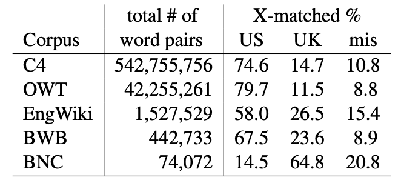

## Spelling Convention Sensitivity in Neural Networks

Elizabeth Nielsen, Christo Kirov, Brian Roark - EACL Findings 2023

Presented by Aarohi Srivastava on April 28, 2023

### Introduction
* Topic of interest: spelling convention consistency in language models (specifically decoding/generation).
* Approach: spelling convention consistency as a linguistic dependency.
* Past work on syntactic dependencies:
  * Probability of a grammatical sentence should be higher than an ungrammatical sentence.
  * Given a sentence where the main verb is a blank to fill, the model should prefer the verb that agrees in number to the subject (singular vs. plural).
  * Lots of evidence suggesting that Transformer-based LLMs are able to learn complex syntactic and semantic relationships.
* This work: The authors explore whether T5 and GPT-2 have a preference for maintaining consistency in spelling (American vs. British English) within a sentence when filling in blank spans (T5) or generating the next word (GPT-2).

### Data
* American British English Translator (ABET): list of American and British spelling variants.
  * vapor/vapour
  * realize/realise
  * liter/litre
  * aluminum/aluminium
* Looking at the T5 vocabulary, in some cases (realize/realise), both variants appear in the vocabulary, while in others (vapor/vapour), only the US version appears.
* T5 is trained on Colossal Clean Crawled Corpus (C4), and GPT-2 is trained on WebText (OWT).
* Dataset analysis: For each sentence, extract all distinct pairs of words in the sentence such that both elements of the pair are words in ABET.  These pairs can fall into one of three classes:
  * US-matched - both are US variants
  * UK-matched - both are British variants
  * mismatched - one of each
<!--  -->

### Experiments
* Create templates of the following form to minimize confounds and try to ensure syntactic and semantic acceptability. Templates include one work marked as US or UK, and include a blank span that the model should only fill with spellings belonging to the same variety.
* Two settings for placement of blank: adjacent or non-adjacent.
* Template: My preferred words are ..., ..., and tree.

#### T5
* prompt: 
  * Adjacent: My preferred words are **PRIME**, \<BLANK-SPAN-1\>, and tree.
  * Non-adjacent: My preferred words are **PRIME**, flower, interesting, jump, ponderous, sky, skipping, desk, small, ladder, lovely, \<BLANK-SPAN-1\>, and tree.
* test sentences:
  * My preferred words are realize, {center, centre}, and tree.
    * Probability of choosing *center* should be higher than *centre*.
  * My preferred words are realise, {center, centre}, and tree.
    * Probability of choosing *centre* should be higher than *center*.
* fine-tuning:

#### GPT-2
<!--  -->
 
### Questions
* 
