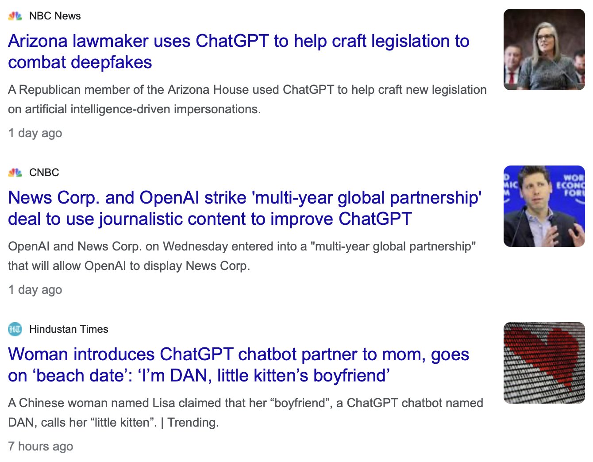

## All About ChatGPT

Presented by Aarohi Srivastava on May 24, 2024

See electronic version here: [https://github.com/aarsri/reading-group/blob/main/chatgpt/chatgpt.md](https://github.com/aarsri/reading-group/blob/main/chatgpt/chatgpt.md)

### Overview

OpenAI has three flagship text generation models, all of which are multilingual.
| | GPT-4o | GPT-4 Turbo | GPT-3.5 Turbo |
| - | ------ | ----------- | ------------- |
| inputs | text, image | text, image | text |
| context length | 128k | 128k | 16k |
| cost (per 1M tokens) for input | $5 | $10 | $0.50 |
| cost (per 1M tokens) for output | $15 | $30 | $1.50 |

The blog post [here](https://dev.to/maximsaplin/gpt-4-128k-context-it-is-not-big-enough-1h02) (Saplin, 2023) provides insight into what this context length means (for English).

Below are examples of short English texts and how many fit inside 128k tokens (Saplin, 2023):


Below are examples of long English texts and how many fit inside 128k tokens (Saplin, 2023):


Note that context window is different from maximum sequence length, which is 4096 tokens for all the models. It is a different question of how easy it is for the model to digest or make use of so much information (see below).

Related to many of the issues regarding tokenization of nonstandard text or text from different scripts and low-resource languages, the following paper by Ahia et al. (2024) provides insight into the inequity in cost when using ChatGPT for different languages. 

[Do All Languages Cost the Same? Tokenization in the Era of Commercial Language Models](https://arxiv.org/pdf/2305.13707) (Ahia et al., 2024)


### OpenAI API
Information about the OpenAI API can be found at: [https://platform.openai.com/docs/overview](https://platform.openai.com/docs/overview)

API calls can be done using curl, Python, and Node.js. In this handout, we focus on Python.

In addition to the GPT-based text generation models, OpenAI API can also be used for several other models, including DALL-E (text2image) and Whisper (speech2text).

The OpenAI [cookbook](https://cookbook.openai.com) has lots of examples of accomplishing specific tasks.

OpenAI stores all API usage data for 30 days.

#### Basics
```
from openai import OpenAI
client = OpenAI()

completion = client.chat.completions.create(
  model="gpt-3.5-turbo",
  messages=[
    {"role": "system", "content": "You are a poetic assistant..."},
    {"role": "user", "content": "Compose a poem..."}
  ]
)

print(completion.choices[0].message)
```

#### Roles
The possible roles are system, user, and assistant. The `messages` list consists of turns of the conversation. The first element is typically to specify the behavior of the system, though this is not required. The generic message if omitted would be something like "You are a helpful assistant."

#### Optional Parameters
Along with `model` and `messages`, there are optional parameters that can be included, such as:
* temperature
* max tokens
* top_p
* stop conditions
* frequency penalty
* presence penalty for certain topics
* prompt (pre-completion text)
* suffix (post-completion text)

#### Function Calls
Another common use case is [function calls](https://platform.openai.com/docs/guides/function-calling). This is particularly relevant when developing an assistant-like AI agent. The developer would define functions, maybe tying them to another API:
```
send_email(to: string, body: string)
get_current_weather(location: string, unit: 'celsius' | 'fahrenheit')
get_customers(min_revenue: int, created_before: string, limit: int)
```
Developing something like this is more complicated than the basic example above. See detailed code [here](https://cookbook.openai.com/examples/how_to_call_functions_for_knowledge_retrieval).

#### Fine-tuning
Finally, there is also a [fine-tuning UI](https://platform.openai.com/docs/guides/fine-tuning) that simply involves uploading the training and testing data and specifying hyperparameters (or using defaults). They suggest that the training size should be 50-100 well-crafted examples. The estimated cost to train on 100,000 tokens of text for 3 epochs is $2.40.

### Directions of NLP Research
Understanding what ChatGPT can do
* [ChatGPT: Jack of all trades, master of none](https://www.sciencedirect.com/science/article/pii/S156625352300177X) (Kocoń et al., 2023)
* [Can ChatGPT Understand Too? A Comparative Study on ChatGPT and Fine-tuned BERT](https://arxiv.org/abs/2302.10198) (Zhong et al., 2023) - great at everything except paraphrase and similarity tasks
* 

Using ChatGPT to accomplish a task
* [Zero-Shot Information Extraction via Chatting with ChatGPT](https://arxiv.org/abs/2302.10205) (Wei et al., 2023)

Addressing problems brought about by the new technology
* detecting AI-generated text
* evaluation of generated text

### Directions of Non-NLP Research
* education
  * [Exploring the opportunities and challenges of NLP models in higher education: is Chat GPT a blessing or a curse?](https://www.frontiersin.org/articles/10.3389/feduc.2023.1166682/full)
  * [Reflection on whether Chat GPT should be banned by academia from the perspective of education and teaching](https://www.frontiersin.org/journals/psychology/articles/10.3389/fpsyg.2023.1181712/full)
  * [Can Chat GPT replace the role of the teacher in the classroom: A fundamental analysis](https://www.jonedu.org/index.php/joe/article/download/2745/2332)
* medicine - particularly medical question answering

### Media

Overview: ChatGPT is being used in all sorts of ways by all sorts of people, so it's gonna make the news. Overall, news articles are informative (i.e., educating people on how to use ChatGPT), relate to scandals (e.g., scientists publishing AI-generated papers that are not accurate), or highlight the capitalist focus of ChatGPT and related tools (e.g., how to make money using ChatGPT, companies selling their data to OpenAI, and companies like Meta and TikTok facilitating AI-generated content and ads).  The highly negative perception of generative AI typically focuses on image generation and deepfakes more than text generation. 

### Usage and Thoughts from the Public


