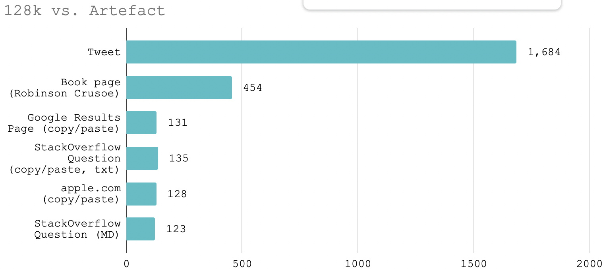
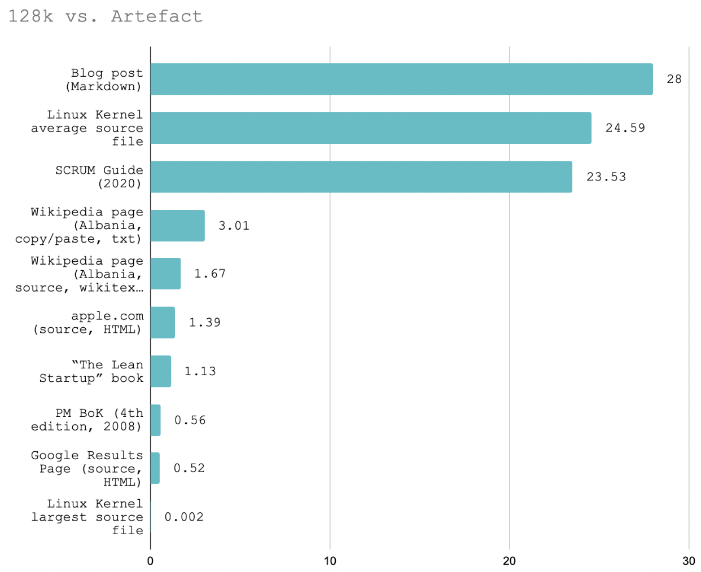
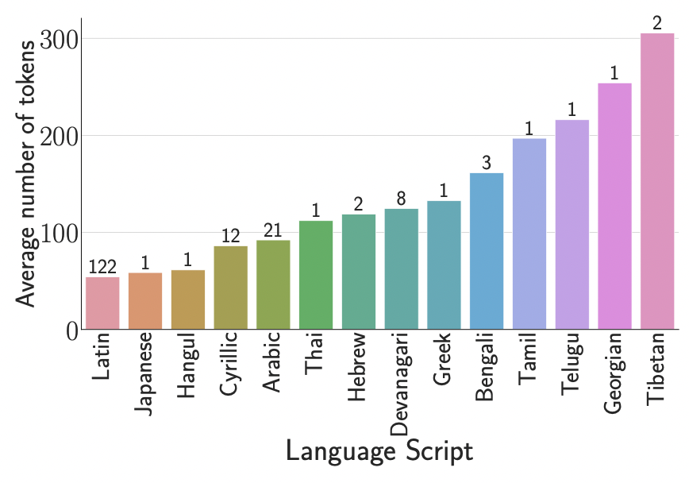
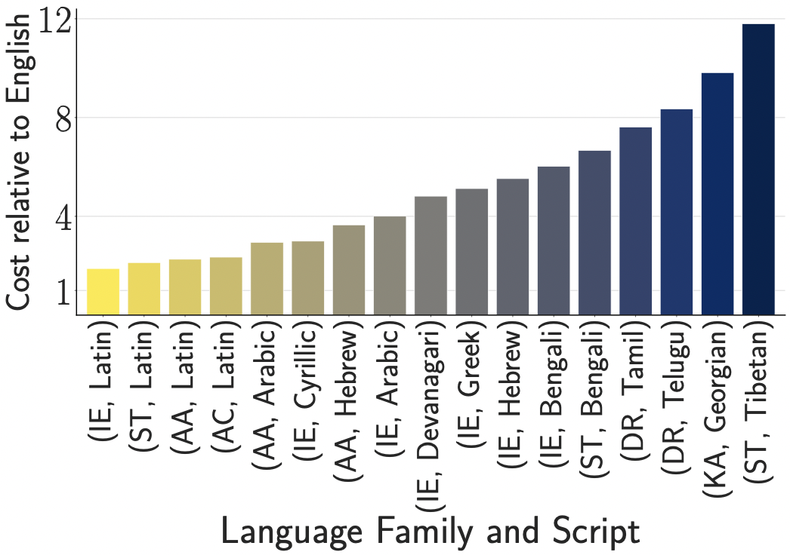

## All About ChatGPT

Presented by Aarohi Srivastava on May 24, 2024

See electronic version here: [https://github.com/aarsri/reading-group/blob/main/chatgpt/chatgpt.md](https://github.com/aarsri/reading-group/blob/main/chatgpt/chatgpt.md)

### Overview

OpenAI has three flagship text generation models, all of which are multilingual.
| | GPT-4o | GPT-4 Turbo | GPT-3.5 Turbo |
| - | ------ | ----------- | ------------- |
| inputs | text, image | text, image | text |
| context length | 128k | 128k | 16k |
| cost (per 1M tokens) for input | $5 | $10 | $0.50 |
| cost (per 1M tokens) for output | $15 | $30 | $1.50 |

The blog post [here](https://dev.to/maximsaplin/gpt-4-128k-context-it-is-not-big-enough-1h02) (Saplin, 2023) provides insight into what this context length means (for English).

Below are examples of short English texts and how many fit inside 128k tokens (Saplin, 2023):

Below are examples of long English texts and how many fit inside 128k tokens (Saplin, 2023):

It is a different question of how easy it is for the model to digest or make use of so much information (see below).

Related to many of the issues regarding tokenization of nonstandard text or text from different scripts and low-resource languages, the following paper by Ahia et al. (2024) provides insight into the inequity in cost when using ChatGPT for different languages. 

[Do All Languages Cost the Same? Tokenization in the Era of Commercial Language Models](https://arxiv.org/pdf/2305.13707) (Ahia et al., 2024)

### OpenAI API
In addition to the GPT-based text generation models, OpenAI API can also be used for several other models, including DALL-E (text2image) and Whisper (speech2text).

### Directions of NLP Research

### Directions of Non-NLP Research

### Opinions from AI Researchers

### Usage and Thoughts from General Audience

