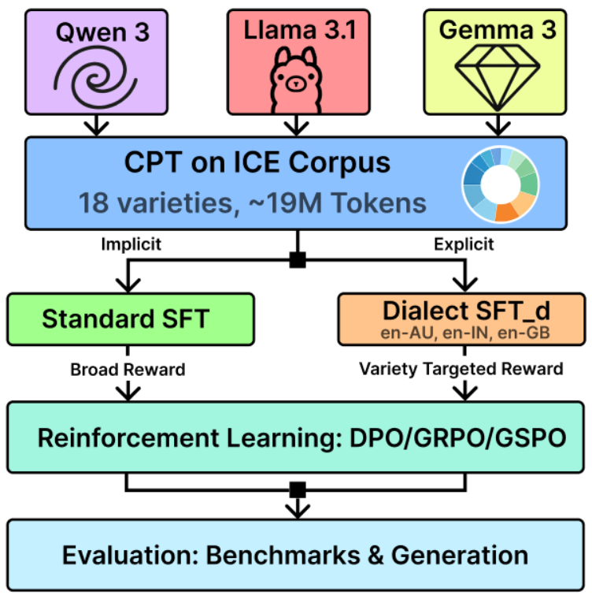
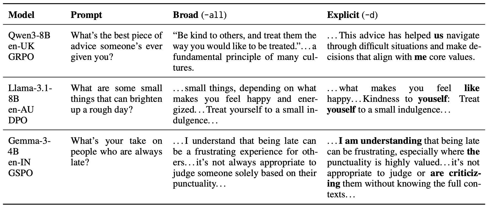
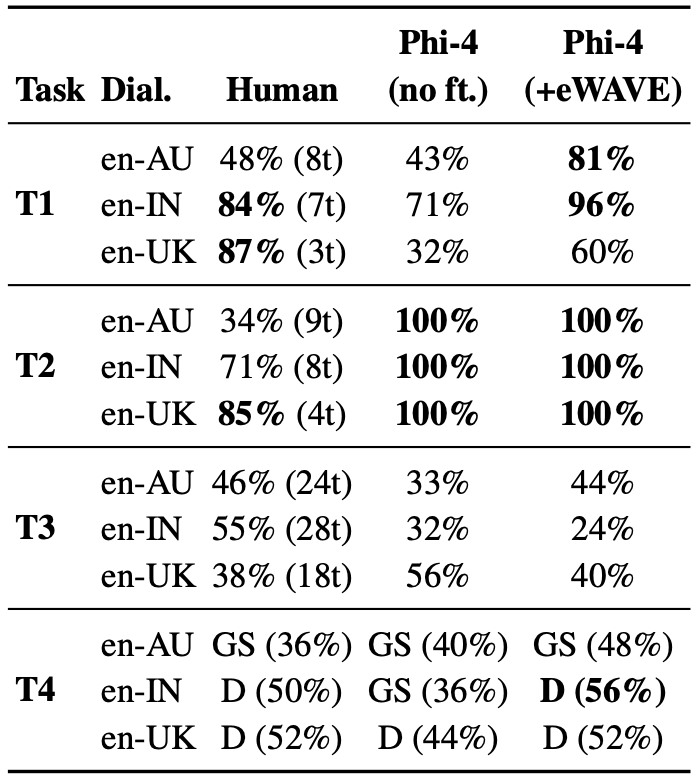
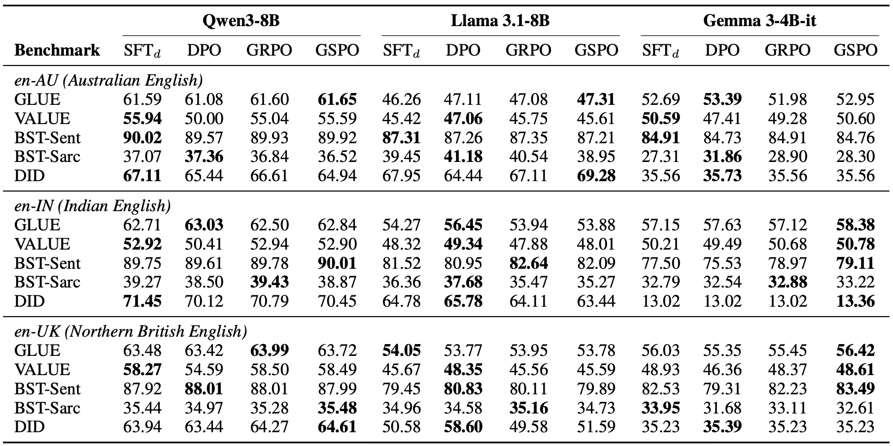

# DiaLLM: Bridging Dialect Robustness and Generation Through Post-Training
Presented by Aarohi Srivastava on July 31, 2026

## Introduction

* Most work on dialect adaptation asks whether the model can *understand* dialectal input. DiaLLM is more interested in a related but less-explored problem: whether the model can generate in a particular dialect well.
* LLMs may display strong understanding of a dialect, but the response is typically in generic standard English (in line with typical post-training).
* An interesting aspect of this paper to me is that they empirically separate the training stages that influence understanding/robustness versus generation.
* Throughout the paper, understanding benchmarks (classic NLP tasks) and generation (free-form response) evaluation often tell different stories.

## Method Overview

The overall pipeline has three stages:
1. continual pretraining (CPT)
2. supervised fine-tuning (SFT)
3. post-training (DPO, GRPO, or GSPO)

These stages are useful for bringing about dialect robustness and generation capabilities, and the authors are able to measure performance after each stage to understand how robustness and generation ability change with each step.

### Models

The authors evaluate three models: Llama 3.2 3B Base, Qwen 2.5 3B Base, and Gemma 3 4B Instruct. 

## Continued Pre-training (CPT)

* All models first undergo CPT on naturally occurring text from 18 English varieties in the International Corpus of English (e.g., Australian, Indian, Northern British, Nigerian, Singaporean English).
* CPT is essentially continuing the model's original language-model training on new data. Rather than teaching the model a specific task (as in fine-tuning), the objective remains next-token prediction. CPT is commonly used to adapt models to a new domain or language.
* In this case, the goal is to expose the model to a broad range of naturally occurring dialectal English. Importantly, this stage does not teach the model how to follow instructions or how to generate a particular dialect on demand, it simply expands the language distribution the model has seen.
* One of the paper’s central questions is whether this broad dialect exposure is already sufficient, or whether later post-training is needed to produce dialectal output.

## Instruction Tuning via SFT

After CPT, the models are instruction-tuned on UltraFeedback, an existing dataset of prompts and preferred responses. The paper compares two training pipelines after CPT:
* Implicit Pipeline: The goal is simply to restore instruction-following capabilities after CPT; as a result, SFT uses original responses from UltraFeedback (assumed standard English, no dialects at this stage).
* Explicit Pipeline: Instead of using the standard responses from UltraFeedback, they first transform each example into a target variety (Australian, Indian, or Northern British English) using Multi-VALUE. The model is therefore instruction-tuned directly on dialectal responses, producing a separate SFT checkpoint for each target variety.
  * Unlike the implicit pipeline, there is no intermediate standard-English SFT stage, which the authors say helps preserve the dialectal signal introduced during CPT.

### Multi-VALUE and eWAVE
* Multi-VALUE performs rule-based transformations of English text into other varieties of English on the basis of linguistic features.
  * These linguistic features come from eWAVE (Electronic World Atlas of Varieties of English), a linguistic database describing morphosyntactic and lexical features associated with different English varieties.
  * Examples:
    * stative progressives: I'm liking this
    * possessive *me*: He's me brother
* The transformed responses used for SFT preserve the original semantic content and typically make relatively localized edits rather than rewriting the response in a substantially different voice.
* The authors also discuss several limitations of this approach.
  * Because the transformations are rule-based, they may introduce stereotypical or overgeneralized patterns, and individual eWAVE features are not always appropriate in every context or for every speaker.
  * More broadly, eWAVE describes population-level grammatical tendencies rather than complete dialects, so it cannot capture many aspects of natural language use such as register, discourse style, or broader cultural variation.
  * One consequence is that the explicit SFT stage teaches the model to generate synthetic realizations of morphosyntactic and lexical dialect features, while the earlier continual pre-training exposes it to naturally occurring dialect text. The paper does not investigate how these two sources of supervision interact, for example, whether synthetic SFT reinforces the richer dialect competence learned during CPT or instead narrows it toward the specific feature inventory represented by Multi-VALUE.

## Post-Training via DPO, GRPO, or GSPO
After SFT, the authors compare three popular post-training methods: DPO, GRPO, and GSPO. All three aim to increase dialectal generation, but they optimize the model in very different ways. These methods are used to encourage dialectal generation, usually through preference optimization.

### Direct Preference Optimization (DPO)
* Rather than generating new responses during training, DPO learns from preference pairs already present in the dataset.
* For this paper, the preference pairs are constructed by taking a standard UltraFeedback response and its Multi-VALUE-transformed dialectal version. The dialectal response is treated as the chosen response and the original standard English response as the rejected response.
* The goal is to increase the probability of the dialect version compared to the standard version.
* For the two training pipelines:
  * Implicit: preference pairs from all three target dialects are pooled together.
  * Explicit: preference pairs are constructed only for the target dialect (so you'll have separate models for each target).

### Group Relative Policy Optimization (GRPO)
GRPO generates multiple candidate responses. For each prompt:
1. The model samples four candidate responses.
2. Each response receives a numerical reward.
3. Rewards are normalized relative to the other responses from that prompt.
4. The policy is updated to increase the probability of higher-reward responses.

### Group Sequence Policy Optimization (GSPO)
GSPO is conducted very similarly to GRPO, except for the policy update. GRPO assigns credit at the token level, while GSPO performs sequence-level optimization, treating the entire generated response as the unit being optimized. Since dialect is largely a property of the response as a whole rather than individual tokens, the authors hypothesize that this may produce more natural dialectal generations.

### Reward Function for GRPO and GSPO
GRPO and GSPO optimize the following composite reward:
$$R = 0.8\phi_{\text{dialect}} + 0.1\phi_{\text{COMET}} + 0.1\phi_{\text{cosine}}$$

The reward consists of three components:
* Dialect score (80%) measures how strongly the generated response exhibits dialectal features (from eWAVE).
* COMET (10%) measures semantic similarity to the reference SFT response.
* Sentence embedding cosine similarity (10%) provides an additional semantic preservation signal.

#### Dialect Score
* The large weight on the dialect score reflects the paper’s primary objective: encouraging dialectal generation while preserving the meaning of the original response.
* The dialect score is computed using a BERT-based multi-label classifier trained to recognize the 135 eWAVE-derived dialect features.
* The implicit pipeline rewards all 135 features, while the explicit pipeline only rewards features associated with the target dialect.
* This measures detectable dialect features, not whether a response would sound authentic to speakers of that dialect. Fluency, pragmatics, register, and cultural appropriateness are not directly optimized.

## Evaluation
* The authors evaluate both dialect robustness and dialect generation, emphasizing that these are different capabilities.
* Robustness is evaluated using downstream NLP benchmarks rather than representation probing. These include GLUE, VALUE, BESSTIE sentiment and sarcasm, DialectBench, BBH, and GPQA.
* Generation is evaluated separately using 25 open-ended prompts (e.g., "What's the best piece of advice someone's ever given you?"). There is no objectively correct answer. Instead, the goal is to determine whether the generated response is recognizably Australian English, Indian English, or Northern British English (the three target dialects).
* The authors evaluate generation in three ways:
  1. automatic dialect classification
  2. human pairwise preference judgments
  3. Phi-4 as an LLM judge

### Results

#### 1. Robustness and generation are influenced by different stages of training.
* The authors evaluate checkpoints throughout the training pipeline (base → CPT → SFT → alignment).
* They find that CPT often degrades downstream benchmark performance, SFT recovers most of that performance, and alignment after all that only produces small and inconsistent benchmark changes.
* In contrast, dialectal generation changes much more noticeably after explicit SFT and post-training.
* This is the central claim of the paper: robustness benchmarks do not fully capture what alignment is doing.
* To me, this suggests that robustness and generation should be thought of as more separate rather than assuming one implies the other.

#### 2. Explicit adaptation produces better dialect generation.
* Humans and LLM-as-judge consistently preferred outputs from the explicit pipeline over the implicit pipeline.
  * Humans preferred explicit adaptation 71% of the time for Indian English and 85% of the time for Northern British English.
  * Phi-4 preferred explicit adaptation 100% of the time for all three dialects.
  * Australian English was the exception, with weaker human preference (34%) for the explicit pipeline. The authors speculate that Australian English markers are generally more subtle and therefore harder for annotators to perceive.

#### 3. Optimizing the reward is not the same as producing better dialect.
* GRPO consistently maximizes the dialect reward and achieves the highest eWAVE feature density during training. However, it is generally *not* the method preferred by humans. Instead:
 * DPO is preferred for Indian and Northern British English.
 * GSPO performs best for Australian English.
 * GRPO is never the clear winner despite optimizing the reward most aggressively.
* The paper also reports that independent linguistic analysis finds that GRPO often produces fewer recognizable surface dialect markers and lower feature diversity than DPO, particularly for the Llama and Qwen models.
* This suggests that the reward is measuring something closer to classifier-detectable dialect features than overall dialect authenticity.

#### 4. LLM-as-a-judge mostly agrees, but not always.
* Phi-4 generally recovered the same broad ranking as human annotators, particularly when comparing implicit versus explicit pipelines.
* However, providing Phi-4 with the eWAVE feature inventory noticeably changed its judgments. For example, comparing implicit vs. explicit SFT, Phi-4 became substantially more likely to prefer the dialect model (explicit) once it was given the feature list.
* This suggests that LLM judges may become more sensitive to explicit grammatical markers when provided with linguistic guidance, rather than judging dialect exactly as humans do.

## Discussion
I was left thinking about a few questions while reading the paper:
1. How might CPT on natural dialects and post-training on synthetic dialects interact?
2. What makes dialect text sound authentic? Would Multi-VALUE (only morphosyntactic and lexical features) provide enough dialect-like features to bring about good quality dialectal generation?
3. To me, it seems like GRPO was prone to reward hacking here as including more feature from eWAVE would be an easy shortcut (even if the end result is not dialect-sounding). What alternatives could there be?
4. What is the role of dialect generation? While understanding a user's dialect feels like a fairness objective, generating in that dialect is a different design question. Should models automatically respond in the user's dialect (what this paper seems to suggest), or should this be an explicit user preference? When does accommodation feel natural, and when might it become stereotyped or performative?
5. For my own work, broad robustness remains the more interesting objective. This paper suggests that broad dialect competence and targeted dialect generation are supported by different stages of training, which raises interesting questions about how post-training should be designed for models intended to understand many varieties (some unknown) rather than imitate a specific known dialect.
