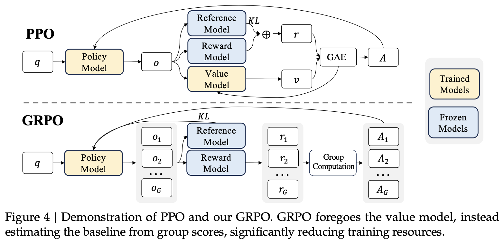
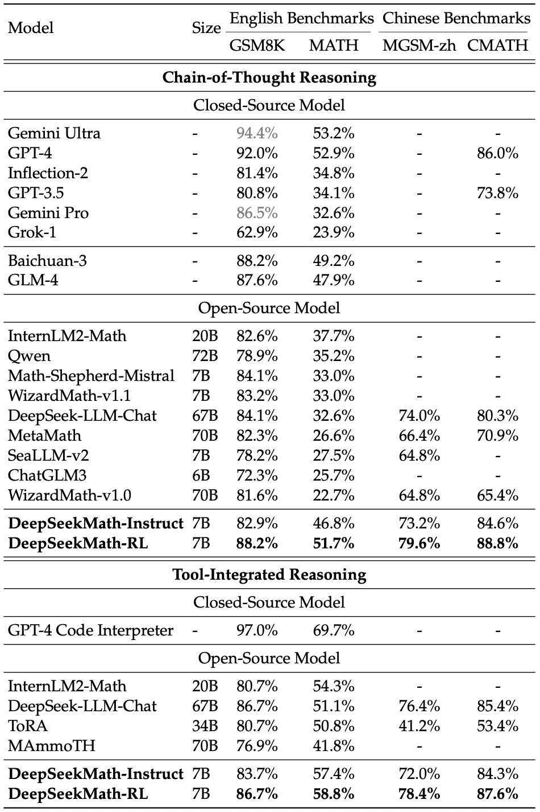

## Group Relative Policy Optimization (GRPO)

Introduced by Shao et al. (2024) in *DeepSeekMath: Pushing the Limits of Mathematical Reasoning in Open Language Models*.

Presented by Aarohi Srivastava on June 19, 2026.

### If PPO already works, why GRPO?

- Over the past few weeks, we've discussed several approaches to LLM post-training:
  - **RLHF** uses human preferences to train a reward model.
  - **PPO** uses reinforcement learning to optimize a policy with respect to that reward model.
  - **DPO** removes the reinforcement learning stage entirely and directly learns from preference pairs.
- At this point, it is natural to ask: If PPO works and DPO avoids reinforcement learning altogether, why do we need another method?
- Part of the answer comes from the type of task we are trying to optimize. In domains like math and coding, there is often an objective notion of success. A math problem may have a correct numerical answer. A coding problem may pass (or fail) a set of unit tests.
- This does not eliminate human preferences entirely. Two correct solutions may differ in readability, explanation quality, or style. However, unlike open-ended dialogue, these domains also provide a relatively cheap automatic reward signal.
- This creates an interesting situation. DPO became popular in part because PPO-style RLHF can be expensive and complicated. Yet reasoning tasks provide the type of reward signal that makes reinforcement learning appealing again.
- DeepSeekMath asks: Do we really need every component of PPO for reasoning tasks? To this end, the paper introduces **Group Relative Policy Optimization (GRPO)**, a PPO variant that removes the critic (value model) and instead estimates advantage by comparing responses within a group.

### PPO recap

- Recall that PPO training typically involves four components:
  1. **Policy model**: the LLM being optimized.
  2. **Reward model**: assigns rewards to generated responses.
  3. **Critic**: predicts expected reward.
  4. **Reference model**: prevents the policy from drifting too far from its initial behavior.
- Given a prompt, the policy generates a response. The reward model assigns a reward, while the critic estimates how much reward was expected. PPO then computes an advantage $A = R - V$ where $R$ is the observed reward and $V$ is the critic's prediction.
- Intuitively:
  - positive advantage → this response was better than expected
  - negative advantage → this response was worse than expected
- The policy is updated to make responses with higher advantage more probable.

### The problem with PPO

- PPO works well, but it comes with a cost. The critic must be trained alongside the policy. In practice, this means maintaining and updating another large model during training.
- This introduces several challenges:
  - additional memory requirements
  - additional computation
  - instability due to critic errors
  - more complicated training pipelines
- GRPO asks whether we can estimate advantage without training a separate critic.

### The core idea behind GRPO

Suppose we ask the model the same question multiple times.

**Prompt:** Solve 17x24.

The model generates four responses:

A. *Real answer from GPT-5.5:*

You can compute it as:

$17 \times 24 = 17 \times (20 + 4)$

$= (17 \times 20) + (17 \times 4)$

$= 340 + 68$

$= 408$

Answer: 408 ✅

B. $17 \times 24 = 408$

C. $17 \times 24 = 340$

D. 340

If we only care about correctness, we might assign rewards as:
| Response | Reward |
|-----------|----------|
| A | 1.0 |
| B | 1.0 |
| C | 0.0 |
| D | 0.0 |

If we also care about response quality, a learned reward model might instead assign:
| Response | Reward* |
|-----------|----------|
| A | 1.0 |
| B | 0.9 |
| C | 0.1 |
| D | 0.0 |

Either way, in the absence of a critic we no longer ask: Was response A better than expected? Instead, GRPO asks: How did response A compare to the other responses in the group? The group itself becomes the baseline. Instead of learning a separate estimate of expected reward, GRPO derives that estimate from the sampled responses.

*Keep in mind that the reward model is supervised by preference rankings but not numerical reward scores. These numbers are internal; whether they are on a scale of [0, 1] or [-15, -5] does not matter. For readability we will assume the range is normalized to [0, 1].

### What actually happens during training?

The training loop looks roughly like:
1. Sample a prompt from the post-training dataset.
2. Generate multiple responses from the current policy (LLM). A typical group size is 8.
3. Compute rewards for each response.
4. Normalize rewards within the group.
5. Compute advantages.
6. Update the policy through backpropagation.

The correct responses receive positive advantage relative to the group and become more likely under the policy. The incorrect responses receive negative advantage and become less likely.

Unlike DPO, the model learns from its own generated responses. Unlike PPO, no critic is trained.

### Group-relative advantage

- The intuition is: $A_i = R_i - \text{group average reward}$
  - responses above the group average receive positive advantage
  - responses below the group average receive negative advantage
- This captures the main idea behind GRPO: reward responses that perform better than their peers.
- For the first example above, the average reward is $\mu = 0.5$. Responses A and B receive $1.0 - 0.5 = 0.5$ advantage, while responses C and D receive $0.0 - 0.5 = -0.5$ advantage.
- The actual DeepSeekMath implementation goes one step further and normalizes rewards using the group's mean and standard deviation. This normalized quantity serves as the advantage signal used during optimization.

  $$\hat r_i = \frac{r_i-\text{mean}(r)}{\text{std}(r)}$$

#### Example

Suppose the model generates four responses with rewards:

| Response | Reward |
|-----------|----------|
| A | 10 |
| B | 8 |
| C | 4 |
| D | 2 |

The average reward is $\mu = 6$

Relative to the group:

| Response | Relative Reward |
|-----------|----------|
| A | +4 |
| B | +2 |
| C | -2 |
| D | -4 |

GRPO therefore increases the probability of A and B while decreasing the probability of C and D.

The key idea is that no critic was needed to determine which responses were above or below expectation. The group itself provides the baseline.

### Why is GRPO particularly useful for reasoning?

GRPO works best when rewards can be computed automatically. In math, $\text{correct answer} \rightarrow 1$ and $\text{incorrect answer} \rightarrow 0$. In coding, rewards may be based on unit tests passed, execution success, benchmark scores. 

Notably, the reward function does **not** need to capture every aspect of response quality. In many reasoning settings, the model is rewarded only for correctness. In fact, recent reasoning work in reinforcement learning finds that improving correctness often improves reasoning quality as well. By repeatedly reinforcing successful trajectories, the model gradually shifts toward more effective reasoning patterns.

### Reward model

GRPO removes the **critic**, not the reward model. If the reward is based on preference and not just objective measures, it is still a large model. The reward signal can come from multiple sources:
* Learned reward models: As in RLHF, humans can rank responses and train a reward model (Response A > Response B). The reward model learns to assign higher scores to preferred responses.
* Automatic rewards: Objective measures like exact answer correctness, symbolic verification, unit-test pass rate computed automatically without a neural model. This is the setting emphasized by DeepSeekMath, and in this case, we will see a real saving in compute compared to PPO because the policy LLM is the only large model.

### Assumptions behind GRPO

GRPO makes several assumptions:
1. The model is already somewhat competent: If every generated response is poor, there is little useful signal. This is one reason GRPO is typically applied *after* instruction tuning rather than directly on a base model. For example, a typical workflow may be pretraining on web-crawled text $\rightarrow$ supervised fine-tuning for instruction tuning on AYA $\rightarrow$ post-training with GRPO for reasoning.
2. Relative performance is informative:  GRPO assumes that comparing responses within a group is a useful proxy for expected performance. This replaces the role previously played by the critic.
3. The reward function is meaningful: GRPO can only optimize what the reward function measures. If the reward function is flawed, the model may learn undesirable behaviors.

### DeepSeekMath

The DeepSeekMath paper is about more than GRPO. Its contributions include:
1. A large mathematical corpus.
2. DeepSeekMath base and instruction-tuned models.
3. GRPO as a reinforcement learning method for mathematical reasoning.

The choice of math is important because rewards can be computed automatically. This allows large-scale reinforcement learning without requiring human annotators to rank every generated response.

One of the paper's main findings is that reinforcement learning (via GRPO) continues to improve performance even after instruction tuning has already been performed (via SFT).

### How does GRPO compare to PPO and DPO?

| Method | Reward Model | Critic | RL | LLM Generation |
|----------|----------|----------|----------|----------|
| PPO-RLHF | ✓ | ✓ | ✓ | ✓ |
| DPO | ✗ | ✗ | ✗ | ✗ |
| GRPO | ~ | ✗ | ✓ | ✓ |

Summary: GRPO can be viewed as a simplified form of PPO. The key insight is that a separate critic is not strictly necessary. Instead, multiple responses to the same prompt can be used to construct a baseline and estimate relative advantage.

### Open Questions
1. If two responses are both correct, which one should be preferred? Is correctness enough? Is there a workaround to full preference-tuning?
2. How vulnerable is GRPO to reward hacking?
3. How much competence is required before GRPO becomes effective? Can these methods work well on a small model or a model without instruction-tuning?
